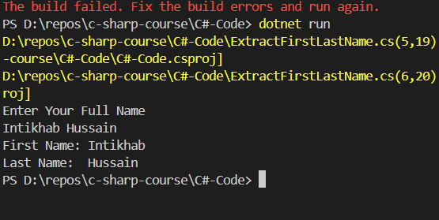
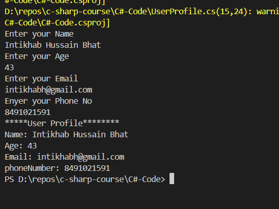
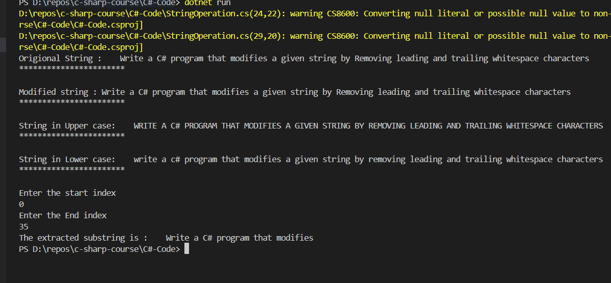
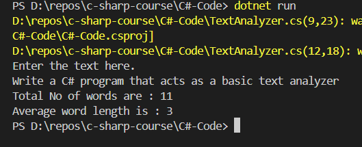

# Write a C# program that prompts the user for their full name and then extracts their first and last names.

```c#
Console.WriteLine("Enter Your Full Name");
string fullName = Console.ReadLine();

//Getting the first name
string firstName = fullName.Substring(0, fullName.IndexOf(' '));
// Getting the last name
string lastName = fullName.Substring(fullName.IndexOf(' '));
Console.WriteLine($"First Name: {firstName}");
Console.WriteLine($"Last Name: {lastName}");

```
## Output


# Write a C# program that sets up a basic user profile by collecting name, email, and phone number using different data types.

```c#

Console.WriteLine("Enter your Name");
string? name = Console.ReadLine();

Console.WriteLine("Enter your Age");
int age;
string inputAge = Console.ReadLine();
int.TryParse(inputAge, out age);

Console.WriteLine("Enter your Email");
string? email = Console.ReadLine();

Console.WriteLine("Enyer your Phone No");
long phoneNumber;
string inputPhoneNum = Console.ReadLine();
long.TryParse(inputPhoneNum, out phoneNumber);


Console.WriteLine("*****User Profile********");

Console.WriteLine($"Name: {name}");
Console.WriteLine($"Age: {age}");
Console.WriteLine($"Email: {email}");
Console.WriteLine($"phoneNumber: {phoneNumber}");
```
## output


# Write a C# program that modifies a given string by:
* Removing leading and trailing whitespace characters.
* Converting the entire string to uppercase or lowercase (user's choice).
* Extracting a specified substring based on user input (start and end indices).

```c#
// ### 3: Text Manipulation Challenge
// Write a C# program that modifies a given string by:
// - Removing leading and trailing whitespace characters.
// - Converting the entire string to uppercase or lowercase (user's choice).
// - Extracting a specified substring based on user input (start and end indices).


string textManupilation="   Write a C# program that modifies a given string by Removing leading and trailing whitespace characters     ";
Console.WriteLine($"Origional String : {textManupilation}");
Console.WriteLine("***********************\n");

string modifiedString=textManupilation.Trim();
Console.WriteLine($"Modified string : { modifiedString}");
Console.WriteLine("***********************\n");
string strUppperCase=textManupilation.ToUpper();
Console.WriteLine($"String in Upper case: { strUppperCase}");
Console.WriteLine("***********************\n");
string strLowerCase=textManupilation.ToLower();
Console.WriteLine($"String in Lower case: { strLowerCase}");
Console.WriteLine("***********************\n");

Console.WriteLine("Enter the start index");
int startIndex;
string strStartIndex=Console.ReadLine();
int.TryParse(strStartIndex, out startIndex);

Console.WriteLine("Enter the End index");
int endIndex;
string strEndIndex=Console.ReadLine();
int.TryParse(strEndIndex, out endIndex);

string extractSubString=textManupilation.Substring(startIndex, endIndex);
Console.WriteLine($"The extracted substring is : {extractSubString}");
```

## Output


#  Write a C# program that acts as a basic text analyzer. 
  * It should Accept user input. Allow the user to enter a string (paragraph or text).
  * Analyze and report statistics:
  * Count the total number of words (consider spaces as word separators).
  * Calculate the average word length. Hint. Average word length = Summation of all letters in each word / Total number of words
  
  ```c#
  Console.WriteLine("Enter the text here.");
  string strParagraph = Console.ReadLine();

  //Total number of words in a paragraph
  int countWords = strParagraph.Split(' ').Length;
  Console.WriteLine($"Total No of words are : {countWords}");

  //Calculating average word Length
  int avgWordLength = strParagraph.Replace(" ", "").Count()/countWords;   Console.WriteLine($"Average word length is :  {avgWordLength}");

```

## Output


