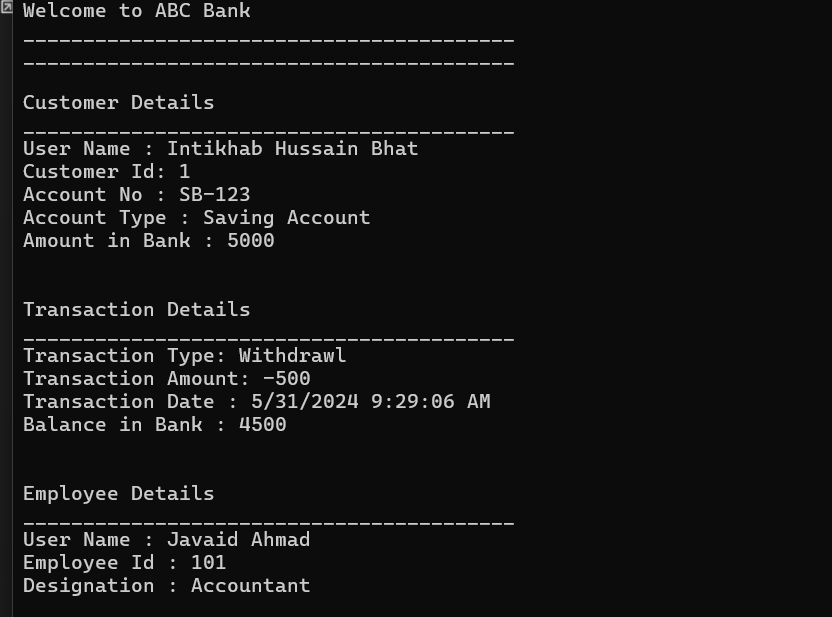

# Assignments - Object Oriented Programming

Assume you are implementing a Banking Application. Identify entities in the system. Create classes and methods for the various operations in a Bank.

* Use necessary access modifiers and encapsulation techniques to protect the data.
* Use constructors to initialize the objects.
* Use inheritance to create a hierarchy of classes.
* Use abstract classes where necessary.
* Simulate some transactions in the application.
  
## Entities and Classes
* Here Base class is BankUser  
* Customer and Employee class inherits from BankUser class
```c#
using System;
using System.Collections.Generic;
using System.Linq;
using System.Text;
using System.Threading.Tasks;

namespace visualstudio_git
{
    //Base Class
    public abstract class BankUser
    {
        //attributes of aclass  accessable within the class only
        private string _firstName;
        private string _lastName;
        private int _age;
        private string _email;
        private string _address;
        private long _phoneNo;

        //Constructor of claas to initialize attributes of a class
        public  BankUser(string fname,string lname, int age,string email,string address,long phoneNo)
        {
            this._firstName = fname;
            this._lastName = lname; 
            this._age = age;
            this._email = email;
            this._address = address;
            this._phoneNo = phoneNo;


        }

        //base method
       public abstract void DisplayInfo();


    }

   // Employee class inherits from Bankuser Class
    class Employee : BankUser
    {

        //attribute of the class
        private int _empId;
        private string _designation;

        //Constructor 
        public Employee(string fname, string lname, int age, string email, string address, long phoneNo, int empid, string designation):base(fname,lname,age,email,address,phoneNo)
        {
            this._empId = empid;
            this._designation = designation;

        }

    public override void DisplayInfo()
    {
        Console.WriteLine($"Employee Id : {_empId}");
        Console.WriteLine($"Designation : {_designation}");
    }

    }

     // Customer class inherits from Bankuser Class
    class Customer : BankUser
    {


        private int _customerId;
        private string _designation;

        public Customer(string fname, string lname, int age, string email, string address, long phoneNo, int custid) : base(fname, lname, age, email, address, phoneNo)
        {
            this._customerId = custid;           

        }

        public int GetCustId()
        {
            return _customerId;
        }
       public override void DisplayInfo()
    {
    Console.WriteLine($"Customer id : {_customerId}");
  
    }

    }
}

```

## Acounts Class
```c#
using System;
using System.Collections.Generic;
using System.Linq;
using System.Text;
using System.Threading.Tasks;

namespace visualstudio_git
{
    internal class Accounts
    {
        private string _accountNo;
        private string _acouyntType;
        private decimal _amountinbank;
        private int _customerId;

        public Accounts(string actno,string acttype,decimal bankamount,int custid) {
            
            this._accountNo = actno;
            this._acouyntType = acttype;    
            this._amountinbank = bankamount;
            this._customerId = custid;
            

        }

        // to get the balance amount in bank
        public decimal GetBalance()
        {
            return _amountinbank;
        }

        // this method update the amount
        public void UpdateBalance(decimal amount)
        {
            _amountinbank += amount;
        }

        public void GetAccountDetails() {

            Console.WriteLine($"Customer Id: {_customerId}");
            Console.WriteLine($"Account No : {_accountNo}");
            Console.WriteLine($"Account Type : {_acouyntType}");
            Console.WriteLine($"Amount in Bank : {_amountinbank}");
        
        }


        public string GetAcountNo()
        {
            return _accountNo;
        }

    }
}

```

## Transaction Class
```c#
using System;
using System.Collections.Generic;
using System.Linq;
using System.Text;
using System.Threading.Tasks;

namespace visualstudio_git
{
    internal class Transactions
    {
        private string _accountNo;  // Reference to the account involved in the transaction
        private decimal _transAmount;
        private DateTime _transDate;
        private string _transType;


        public Transactions(string actNo,decimal amount,DateTime date, string transtype) { 

                this._accountNo = actNo;
                this._transAmount = amount; 
                this._transDate = date;
                this._transType = transtype;    
                
        
        }


        public void GetTransactionDetails()
        {
            //Console.WriteLine($"Acount No : {_accountNo}");
            Console.WriteLine($"Transaction Type: {_transType}");
            Console.WriteLine($"Transaction Amount: {_transAmount}");
            Console.WriteLine($"Transaction Date : {_transDate}");
        }

        public decimal GetWithdrawlAmount()
        {
            return _transAmount;
        }


    }
}

```

## Program Class (Entry point of the application)
```c#
using System.ComponentModel;
using visualstudio_git;

Console.WriteLine("Welcome to ABC Bank");
Console.WriteLine("_________________________________________");
Console.WriteLine("_________________________________________\n");

Console.WriteLine("Customer Details");
Console.WriteLine("_________________________________________");
////creating an instance of Customer  class 
var customer1 = new Customer("Intikhab Hussain","Bhat",43,"intikhabh@gmail.com","Nowgam By-Pass Srinagar",8491021591,1);
//Getting Customer Details
customer1.DisplayInfo();

////creating an instance of Account class 
var acountdetails = new Accounts("SB-123", "Saving Account", 5000, customer1.GetCustId());

//Geting the Account details of the customer
acountdetails.GetAccountDetails();

Console.WriteLine("\n");
Console.WriteLine("Transaction Details");
Console.WriteLine("_________________________________________");
////creating an instance of Transaction class 
var transDetails = new Transactions(acountdetails.GetAcountNo(),-500,DateTime.Now,"Withdrawl");


//Geting the transaction details of the customer
transDetails.GetTransactionDetails();
//updating the amount in customer account
acountdetails.UpdateBalance(transDetails.GetWithdrawlAmount());
Console.WriteLine($"Balance in Bank : {acountdetails.GetBalance()}");


Console.WriteLine("\n");
Console.WriteLine("Employee Details");
Console.WriteLine("_________________________________________");
//creating an instance of Employee class 
var empDetails = new Employee("Javaid","Ahmad",38,"abc@gmail.com","Natipora Srinagar",1234567890,101,"Accountant");

//Gets the employee details
empDetails.DisplayInfo();

```
## output

